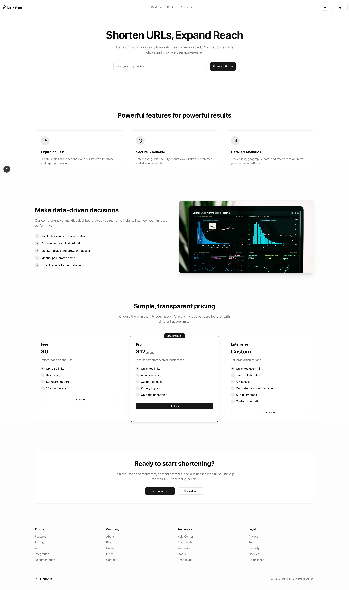
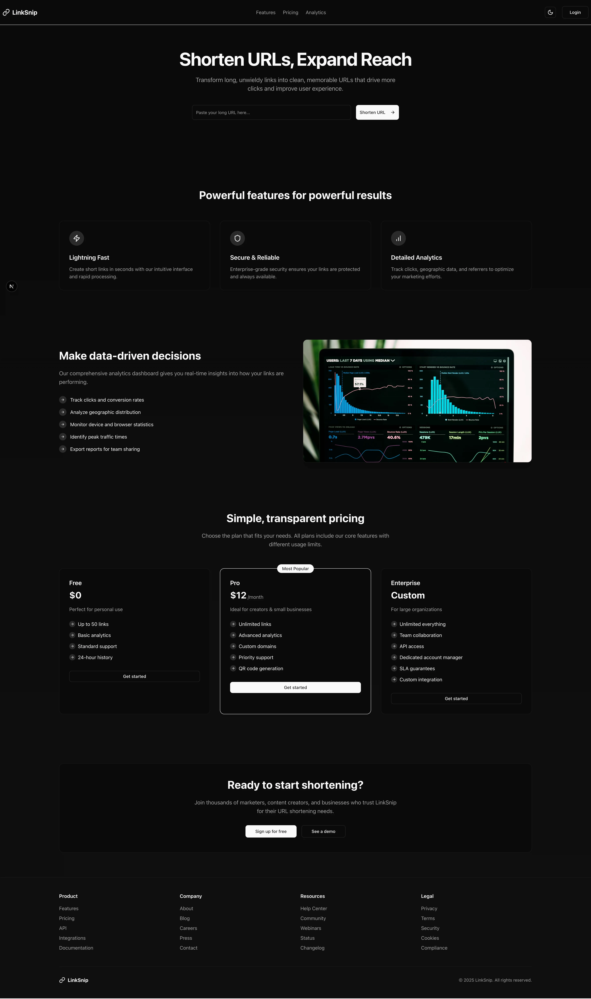
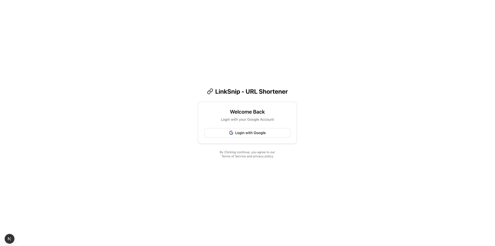
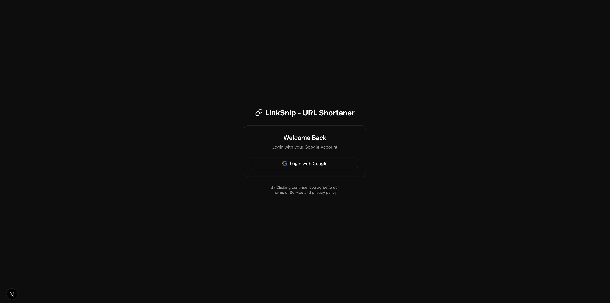
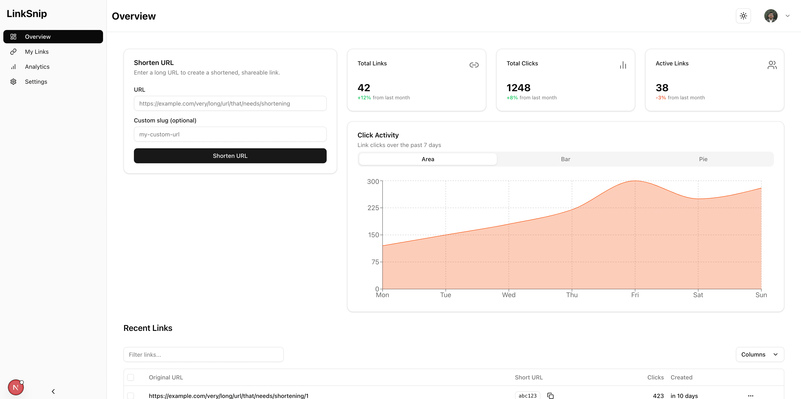
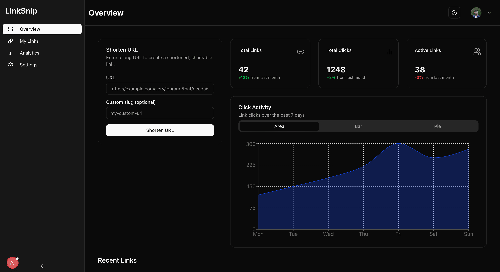
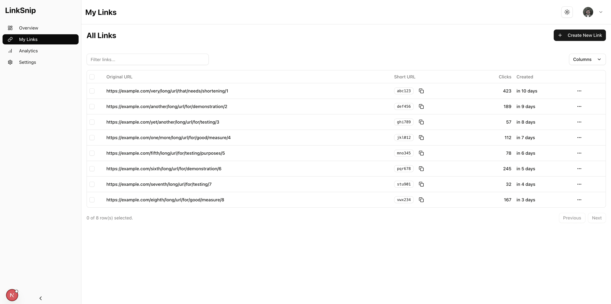
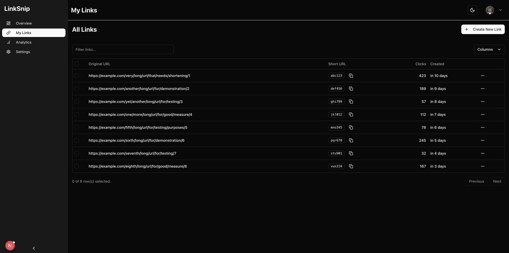

# URL Shortener

<!-- A web-based application that allows users to shorten URLs, track analytics, and manage links with authentication and user-friendly features. -->
## **URL Shortener – Simplifying Link Management with Analytics**

**URL Shortener** is a **web-based application** designed to help users efficiently shorten URLs, track link analytics, and manage their links in a structured and intuitive way. Whether it's for personal use or business needs, this tool provides **real-time analytics, user authentication, and seamless link management** to ensure users have complete control over their shortened URLs.

With features like **user authentication, detailed analytics on link performance, and easy link sharing**, **URL Shortener** makes managing links effortless. Users can visualize their link performance, track clicks, and manage their URLs without the hassle of complex setups. The platform is built with a user-friendly interface, ensuring a smooth experience while prioritizing data privacy and security. Whether you're an individual looking to share links or a business needing to track marketing campaigns, **URL Shortener** simplifies the process, helping you **share smarter and track better**.

## 📸 Screenshots

### Landing Page
<p align="center">
  
  
</p>

### Login Page
<p align="center">
  
  
</p>

### Dashboard View
<p align="center">
  
  
</p>

### Links View
<p align="center">
  
  
</p>

## 🚀 Features

### ✅ Completed
[✅] User authentication via GitHub & Google\
[✅] Dashboard with link analytics\
[✅] URL shortening functionality\
[✅] Click tracking and reporting\
[✅] Responsive UI with ShadCN components

### ⏳ To Be Completed
[⏳] Custom Short URL (slug) options\
[⏳] Custom URL options\
[⏳] Link expiration settings\
[⏳] Advanced analytics and reporting\
[⏳] User management features\
[⏳] Multi-user collaboration\

## 🛠️ Tech Stack

- **Frontend**: Next.js 15 (TypeScript, App Router), TailwindCSS, ShadCN
- **Backend**: Next.js API routes only
- **Database**: PostgreSQL with Prisma ORM
- **Authentication**: Auth.js (NextAuth)
- **Deployment**: Vercel (Auto-deploys enabled)
- **Security/Monitoring**: ArcJet

## 📋 Prerequisites

- **Node.js & PNPM** installed
- **PostgreSQL** database set up

## 🔧 Installation & Setup

### 1. Clone the repository

```bash
git clone https://github.com/yourusername/URL-Shortener.git
cd URL-Shortener
```

### 2. Install dependencies

```bash
pnpm install
```

### 3. Generate Prisma client

```bash
pnpm dlx prisma generate
```

### 4. Run the development server

```bash
pnpm run dev
```

## 📁 Project Structure

```
├── prisma
│   └── schema.prisma
├── public/
│   ├── logos/
│   ├── screenshots/
├── src/
│   ├── app/
│   │   ├── (mainLayout)/
│   │   │   ├── dashboard/
│   │   │   ├── links/
│   │   ├── actions.ts
│   │   ├── api/
│   │   │   ├── auth/
│   │   │   ├── analytics/
│   │   ├── data/
│   │   ├── login/
│   │   ├── utils/
│   ├── components/
│   │   ├── Dashboard/
│   │   ├── Links/
│   │   ├── forms/
│   │   ├── general/
│   │   ├── ui/
│   ├── hooks/
│   ├── lib/
│   └── types/
├── commitlint.config.ts
├── components.json
├── eslint.config.mjs
├── lint-staged.config.js
├── next-env.d.ts
├── next.config.ts
├── package.json
├── pnpm-lock.yaml
├── postcss.config.mjs
├── README.md
└── tsconfig.json

```

## 📝 Environment Variables (.env)

Create a `.env` file in the root directory and include the following variables:

```env
AUTH_SECRET=
AUTH_GITHUB_ID=
AUTH_GITHUB_SECRET=
AUTH_GITHUB_CALLBACK_URL=
AUTH_GOOGLE_ID=
AUTH_GOOGLE_SECRET=
AUTH_GOOGLE_CALLBACK_URL=
DATABASE_URL=
```

## 🚀 Deployment
The project is automatically deployed using **Vercel**. No CI/CD pipeline is currently configured.

## 🏃‍♂️ Running in Production

```bash
pnpm run build
pnpm start
```

## 🤝 Contribution Guidelines

### 🚀 How to Contribute

1. **Fork the repository.**
2. **Create a new branch** following the commit convention structure:

```sh
git checkout -b <type>/<scope>
```

### **Examples:**
```sh
git checkout -b feat/dashboard
git checkout -b feat/analytics
git checkout -b fix/hydration
```

3. **Make your changes and commit using the proper commit message format.**
4. **Push to your branch:**
```sh
git push origin <type>/<scope>
```
5. **Submit a pull request for review.**

🚨 **Note:** Only the repository owner can merge due to Vercel's hobby limitations.\
💡 Always create a **new branch for each feature or fix** before submitting a pull request.

---

### Commit Message Format

Please follow the commit message convention as enforced by Husky and Commitlint:

### **type** (Choose from the following):

- **build**: Changes that affect the build system or external dependencies
- **chore**: General maintenance tasks
- **ci**: Changes to CI/CD configuration
- **docs**: Documentation updates
- **feat**: New features
- **fix**: Bug fixes
- **perf**: Performance improvements
- **refactor**: Code changes that neither fix a bug nor add a feature
- **revert**: Reverting previous commits
- **style**: Code style changes (formatting, missing semi-colons, etc.)
- **test**: Adding or updating tests

### **scope** (Optional)
A specific area of the codebase affected (e.g., `auth`, `dashboard`).

### **subject**
A short, descriptive message (**in lowercase, no period at the end**).

#### **Example:**
```sh
git commit -m "feat(auth): add Google OAuth support"
git commit -m "fix(dashboard): resolve incorrect expense calculation"
git commit -m "docs(readme): update contribution guidelines"
```

## 📄 License

This project is a **side project** and does not include a formal license.

---

For any questions or contributions, feel free to open an issue or submit a PR!
